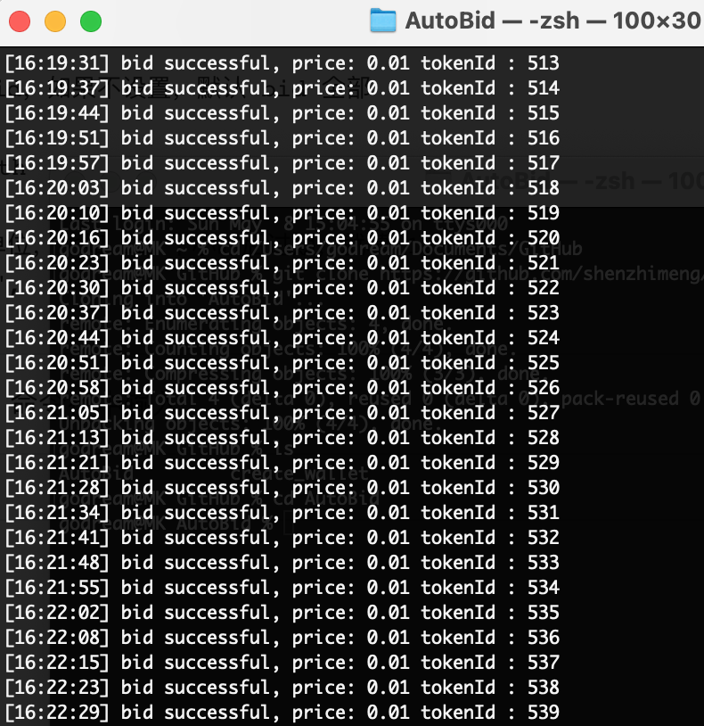

OpenSea 更新了api，这份代码可能不适用了

# 功能
OpenSea 自动出价工具

## 注意事项

1、需要用到助记词，用小号来操作，代码开源，助记词保存在你自己电脑，风险自担

2、需要自己申请 OpenSea 的 API KEY，和 INFURA 节点 KEY

- OpenSea API KYE：https://docs.opensea.io/reference/request-an-api-key
- INFURA：https://infura.io/

3、出价使用的是 WETH，使用之前先去 OpenSea 出价，授权 WETH

4、OpenSea 限制，你所有的出价加起来，不能超过你钱包余额的1000倍

5、建议先在测试网上先测试一下，在 `config.js` 文件中可以配置 rinkeby 测试网

- OpenSea 测试网：https://testnets.opensea.io/

## 电脑需装

1、需要安装 Node.js，有了的可以跳过，下载安装链接

http://nodejs.cn/download/

2、安装 yarn，有了的跳过，命令行安装

```
npm install -g yarn
```

网址：https://www.yarnpkg.cn/getting-started

## 使用步骤

1、clone 或者下载源码之后，命令行中 cd 到文件目录，初始化

```
yarn install
```

2、配置 `secret.js`  文件中字段，这个比较私密，切记用小号

```
module.exports = Object.freeze({
    // INFURA 节点 key
    INFURA_KEY: "",
    // OpenSea api key
    OS_API_KEY: "", 

    // 钱包地址和助记词
    OWNER_ADDRESS: "",
    MNEMONIC: ""
})
```

3、配置 `config.js`，这里面是设置要出价的合约，金额，过期时间，tokenId 等信息

```
module.exports = Object.freeze({
     // mainnet or rinkeby，如果想在测试网上测试，填 rinkeby
     NETWORK: "mainnet",
     // NFT 合约地址
     NFT_CONTRACT_ADDRESS: "", 
     // 开始 bid 的 token id，如果不设置，默认为 1
     TOKEN_ID_START: "1",
     // 截止 bid 的 token id，如果不设置，默认 bid 全部
     TOKEN_ID_END: "",
     // 出价金额, 单位默认 weth，请自己计算好钱包中 weth 余额
     OFFER_PRICE: "0.01",
     //  过期时间, 以小时为单位，比如 12 个小时后过期，就填 12
     EXPIRATION_TIME: "12",
})
```

4、配置好之后，就可以运行了，命令行中输入

```
node auto-bid.js
```

5、效果



## 依赖的开源库

1、opensea-js

https://github.com/ProjectOpenSea/opensea-js

2、@0x/subproviders

https://www.npmjs.com/package/@0x/subproviders

就这两，都是 OpenSea 的开源代码中有使用的


## 目前存在的问题

不知道是我 VPN 问题还是 OpenSea 的问题，偶尔会出现 bid 失败的情况，如图


会卡很久时间，不过只要网没问题，过后会自动下一个


## 有问题联系

推特：https://twitter.com/ruoshuidao


